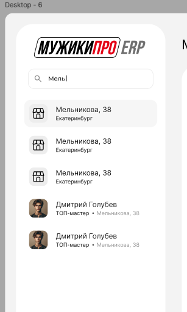
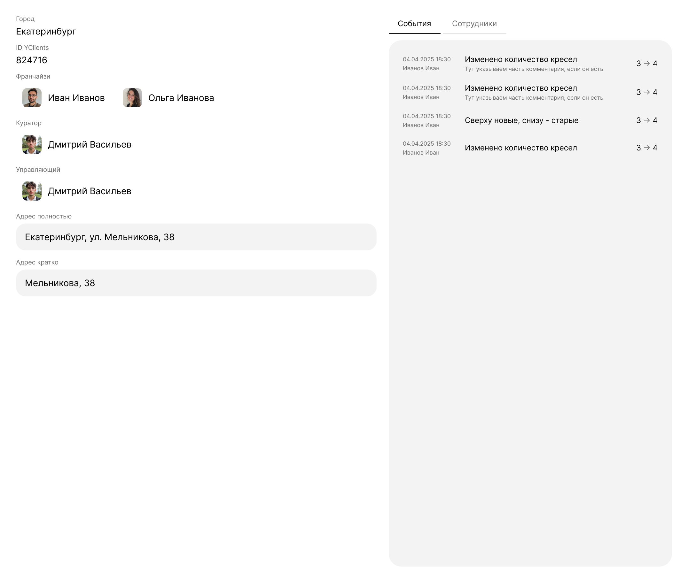

# Тестовое задание на позицию технического аналитика

## Задача 1. Обработка событий внешней системы.
Во внешней системе происходят события по разным сущностям. Каждое входящее сообщение имеет поля:

entity: `client` | `order` | `visit`

event: `created` | `updated` | `deleted`

payload: JSON, структура зависит от пары (entity, event)

Подготовьте техническое задание для разработчика по подготовке приложения для обработки таких событий. 
Код должен быть расширяемым на случай добавления новых событий или сущностей. 
Нужна реализация именно структуры проекта и маршрутизации событий по обработчикам, содержимое самих обработчиков не важно.

## Задача 2. Проектирование API для экрана.
### 2.1. Поиск
Перед вами макет экрана поиска. Информация о салонах и мастерах хранится в разных таблицах базы данных. Общее количество записей не более 1500. Напишите техническое задание для разработчика по реализации поиска (чтобы при поиске адреса находились и адреса, и мастера на этих адресах, и наоборот, при поиске мастера также выводился и его салон), а также формат результата запроса. Оформите формат в Postman или другой форме, которую находите удобной.

### 2.2. Страница компании
Перед вами макет части страницы компании. Пропишите метод или методы API для получения информации для этой страницы таким образом, чтобы её загрузка была максимально оптимальной. Необходимо подготовить только формат запросов и ответов. Результат представьте в любой удобной для вас форме.

